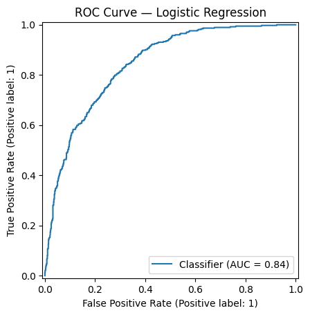
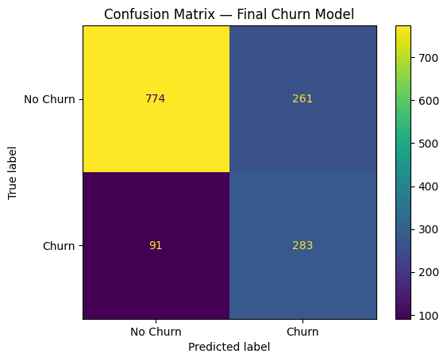

# 📊 Telco Customer Churn Prediction using Machine Learning

## 📌 Project Overview

This project develops a machine learning model to predict customer churn for a telecommunications company.

The objective is to identify customers who are at higher risk of leaving so that the business can take proactive retention actions.

The project follows an end-to-end machine learning workflow covering:

**Exploratory Data Analysis → Feature Engineering → Data Preprocessing → Model Development → Model Comparison → Hyperparameter Tuning → ROC-AUC Evaluation → Threshold Optimization → Model Interpretation → Business Insights → Retention Recommendations**

---

## 🎯 Business Problem

Customer churn can negatively impact a telecom company's revenue and customer base.

The goal of this project is to use customer data to answer questions such as:

* Which customers are more likely to churn?
* Which customer characteristics are associated with higher churn risk?
* Which machine learning model performs better?
* How can the classification threshold be adjusted to identify more potential churners?
* Which factors should the business focus on when designing retention strategies?

---

## 📊 Dataset

The dataset contains **7,043 customer records and 21 columns** covering customer demographics, services, contract information, payment methods, charges, and churn status.

### Key Variables

* Customer ID
* Gender
* Senior Citizen
* Partner
* Dependents
* Tenure
* Phone Service
* Multiple Lines
* Internet Service
* Online Security
* Online Backup
* Device Protection
* Tech Support
* Streaming TV
* Streaming Movies
* Contract
* Paperless Billing
* Payment Method
* Monthly Charges
* Total Charges
* Churn

The target variable is **Churn**.

---

## 🛠️ Tools & Technologies

* **Python**
* **Pandas**
* **NumPy**
* **Matplotlib**
* **Seaborn**
* **Scikit-learn**
* **Logistic Regression**
* **Random Forest**
* **GridSearchCV**
* **StandardScaler**
* **OneHotEncoder**
* **SimpleImputer**
* **Pipeline**
* **ColumnTransformer**
* **Google Colab**

---

# 🔄 Project Workflow

## 1. Data Loading & Initial Inspection

The dataset was loaded using Pandas and examined to understand:

* Dataset dimensions
* Data types
* Missing values
* Numerical and categorical variables
* Target distribution

The original dataset contained **7,043 rows and 21 columns**.

The `customerID` column was removed because it is an identifier and does not provide meaningful predictive information.

After removing it, the machine learning dataset contained **20 features**.

---

## 2. Exploratory Data Analysis

The analysis examined the distribution of churn and explored churn patterns across important customer characteristics.

### Churn Distribution

The dataset contains:

* **5,174 customers who did not churn**
* **1,869 customers who churned**

The overall churn rate was approximately:

**26.54%**

### Churn by Contract

Month-to-month customers showed substantially higher churn:

| Contract       | Churn Rate |
| -------------- | ---------: |
| Month-to-month | **42.71%** |
| One year       | **11.27%** |
| Two year       |  **2.83%** |

This indicates a strong relationship between contract duration and churn.

### Churn by Internet Service

| Internet Service    | Churn Rate |
| ------------------- | ---------: |
| DSL                 | **18.96%** |
| Fiber optic         | **41.89%** |
| No internet service |  **7.40%** |

Fiber optic customers showed the highest churn rate among the three groups.

### Churn by Payment Method

| Payment Method            | Churn Rate |
| ------------------------- | ---------: |
| Bank transfer (automatic) | **16.71%** |
| Credit card (automatic)   | **15.24%** |
| Electronic check          | **45.29%** |
| Mailed check              | **19.11%** |

Electronic check customers showed the highest churn rate.

---

## 3. Feature Engineering

A new feature called **AvgMonthlySpend** was created to represent the customer's average monthly spending over their tenure.

It was calculated using:

`TotalCharges / tenure`

To avoid division by zero, customers with **tenure = 0** were handled by replacing zero tenure with `NaN`.

These customers also had `TotalCharges = 0`, resulting in `NaN` for `AvgMonthlySpend`.

The resulting feature was included as an additional numerical variable in the machine learning preprocessing pipeline.

---

## 4. Feature & Target Preparation

The dataset was separated into:

* **X:** Predictor variables
* **y:** Target variable (`Churn`)

The target was converted from:

* `No → 0`
* `Yes → 1`

The final dataset contained:

* **7,043 observations**
* **20 predictor variables**

---

## 5. Train-Test Split

The dataset was divided into training and testing sets using an **80/20 split**.

`random_state=42` was used to ensure reproducibility.

Stratified sampling was applied to maintain the churn distribution across the training and testing sets.

| Dataset  |   Records |
| -------- | --------: |
| Training | **5,634** |
| Testing  | **1,409** |

---

## 6. Data Preprocessing

A Scikit-learn preprocessing pipeline was created to handle numerical and categorical variables.

### Numerical Features

Numerical features were:

* Median imputed
* Standardized using `StandardScaler`

### Categorical Features

Categorical features were:

* Most-frequent imputed
* Encoded using `OneHotEncoder`

The preprocessing steps were combined using:

* `Pipeline`
* `ColumnTransformer`

This ensured that preprocessing was applied consistently during model training and prediction.

---

# 🤖 7. Model Development

Two classification models were developed and evaluated.

## Logistic Regression

Logistic Regression was used as the primary linear classification model.

Initial test performance:

* **Accuracy:** 80.55%
* **Churn Precision:** 66%
* **Churn Recall:** 56%
* **Churn F1-score:** 60%

Confusion matrix at the default threshold of 0.50:

```text
[[926 109]
 [165 209]]
```

---

## Random Forest

A Random Forest classifier was also developed using:

`n_estimators = 200`

Performance:

* **Accuracy:** 78.50%
* **Churn Precision:** 62%
* **Churn Recall:** 48%
* **Churn F1-score:** 54%

---

# 📊 8. Model Comparison

The two models were compared using accuracy, precision, recall, and F1-score for the churn class.

| Model                   |   Accuracy | Churn Precision | Churn Recall | Churn F1 |
| ----------------------- | ---------: | --------------: | -----------: | -------: |
| **Logistic Regression** | **0.8055** |        **0.66** |     **0.56** | **0.60** |
| Random Forest           |     0.7850 |            0.62 |         0.48 |     0.54 |

### Model Selection

Logistic Regression performed better across the evaluated metrics and was therefore selected for further optimization.

---

# 🎛️ 9. Hyperparameter Tuning

`GridSearchCV` was used to tune the Logistic Regression regularization parameter `C`.

The following values were tested:

```text
[0.01, 0.1, 1, 10, 100]
```

The best parameter was:

**C = 1**

The best cross-validation F1-score was:

**0.5988**

The tuned Logistic Regression model achieved:

**80.55% test accuracy**

with the default classification threshold of 0.50.

---

# 📈 10. ROC-AUC Evaluation

The tuned Logistic Regression model achieved:

## **ROC-AUC = 0.8422**

This indicates that the model has good ability to distinguish between customers who churn and customers who do not churn.

The ROC-AUC metric evaluates the model's ranking ability independently of a specific classification threshold.

### ROC Curve



---

# 🎯 11. Threshold Optimization

The default classification threshold of **0.50** was evaluated against lower thresholds.

| Threshold | Precision |   Recall |       F1 |
| --------: | --------: | -------: | -------: |
|      0.30 |  **0.52** | **0.76** | **0.62** |
|      0.35 |      0.54 |     0.71 |     0.61 |
|      0.40 |      0.57 |     0.67 |     0.61 |
|      0.45 |      0.60 |     0.62 |     0.61 |
|      0.50 |      0.66 |     0.56 |     0.60 |

A threshold of **0.30** was selected as the final threshold because the business objective is to identify more customers who are at risk of churning.

This increased churn recall from:

**56% → 76%**

The trade-off was lower precision, meaning that more non-churning customers would also be flagged for potential retention actions.

---

# 🔎 12. Model Interpretation

The final Logistic Regression model produced **46 transformed features** after preprocessing.

### Features Positively Associated with Churn

The strongest positive coefficients included:

* Fiber optic internet service
* Month-to-month contracts
* Total Charges
* Electronic check payment
* Streaming TV
* Streaming Movies
* No online security
* No technical support
* Multiple lines
* Senior citizen status

### Features Negatively Associated with Churn

The strongest negative coefficients included:

* Tenure
* Two-year contracts
* DSL internet service
* Monthly Charges
* Paperless Billing = No
* No internet service
* No online security/internet service
* Having dependents
* Automatic credit-card payment

Coefficient analysis was used to understand which transformed features were associated with higher or lower churn risk.

> **Note:** Logistic Regression coefficients represent associations within the fitted model and should not automatically be interpreted as causal relationships.

---

# 🏁 13. Final Model Evaluation

The final model used the optimized classification threshold of **0.30**.

### Final Performance

* **Accuracy:** 75%
* **Churn Precision:** 52%
* **Churn Recall:** 76%
* **Churn F1-score:** 62%
* **ROC-AUC:** 0.8422

### Final Confusion Matrix

```text
[[774 261]
 [ 91 283]]
```

The model correctly identified:

**283 out of 374 actual churners.**

That corresponds to a churn recall of approximately **76%**.

The lower classification threshold prioritizes identifying more potential churners, which can be useful when the cost of missing a high-risk customer is greater than the cost of contacting some customers who ultimately do not churn.

### Confusion Matrix



---

# 💡 14. Business Insights

The analysis and model interpretation identified several important churn patterns:

### 1. Month-to-Month Customers Have Higher Churn Risk

Month-to-month customers had a churn rate of **42.71%**, substantially higher than one-year and two-year contract customers.

### 2. Fiber Optic Customers Show Higher Churn

Fiber optic customers had a churn rate of approximately **41.89%**, considerably higher than DSL customers.

### 3. Shorter Tenure Is Associated with Higher Churn

Tenure had one of the strongest negative coefficients in the Logistic Regression model, indicating that longer-tenure customers were strongly associated with lower churn risk.

### 4. Two-Year Contracts Are Associated with Lower Churn

Two-year contract customers had a churn rate of only **2.83%**, compared with **42.71%** for month-to-month customers.

### 5. Electronic Check Customers Show Higher Churn

Electronic check customers had a churn rate of approximately **45.29%**, the highest among the payment methods analyzed.

### 6. Support and Security Services Matter

Customers without online security and technical support showed positive associations with churn in the model.

---

# 🚀 15. Business Recommendations

Based on the analysis, the following retention strategies could be considered:

### 1. Encourage Longer-Term Contracts

Offer targeted incentives to month-to-month customers to encourage migration toward one-year or two-year contracts.

### 2. Focus on Newer Customers

Prioritize retention efforts for customers with shorter tenure, particularly during the early stages of the customer relationship.

### 3. Investigate Fiber Optic Churn

Investigate service quality, pricing, customer experience, and support issues among fiber optic customers.

### 4. Promote Support & Security Services

Consider targeted bundles or incentives for customers who do not currently use online security or technical support.

### 5. Review Electronic Check Customers

Investigate whether the electronic check payment journey, billing experience, or customer characteristics are contributing to the higher churn rate.

### 6. Use the Model for Proactive Retention

Customers with predicted churn probabilities above the selected **0.30 threshold** can be prioritized for retention campaigns.

This allows the business to focus retention resources on customers who are more likely to churn.

---

# 📁 16. Repository Contents

| File                                    | Description                        |
| --------------------------------------- | ---------------------------------- |
| `Telco_Customer_Churn_Prediction.ipynb` | Complete machine learning workflow |
| `telco_churn_cleaned.csv`               | Cleaned dataset used for analysis  |
| `confusion_matrix.png`                  | Final model confusion matrix       |
| `roc_curve.png`                         | ROC curve and AUC visualization    |
| `README.md`                             | Project documentation              |

---

# 🧠 17. Conclusion

This project developed a machine learning solution for predicting customer churn using the Telco Customer Churn dataset.

The workflow covered the complete process from **data exploration and feature engineering to model development, evaluation, interpretation, and business recommendations**.

Logistic Regression outperformed Random Forest during model comparison, achieving:

**80.55% accuracy** and **0.8422 ROC-AUC** at the default classification threshold.

Threshold optimization demonstrated the importance of aligning model predictions with business objectives. By reducing the threshold from **0.50 to 0.30**, churn recall increased from **56% to 76%**, allowing the model to correctly identify **283 of the 374 actual churners**.

The model interpretation highlighted important churn-associated factors such as:

* Month-to-month contracts
* Fiber optic service
* Electronic check payments
* Shorter tenure
* Lack of online security
* Lack of technical support

These insights can help a telecom company prioritize high-risk customers and develop targeted retention strategies.

Overall, the project demonstrates how **machine learning, model interpretation, and business analysis** can be combined to transform customer data into actionable retention decisions.

---

## ⭐ Key Takeaway

> **The goal is not simply to predict who will churn — it is to identify actionable patterns and use those predictions to support better customer retention decisions.**

---
